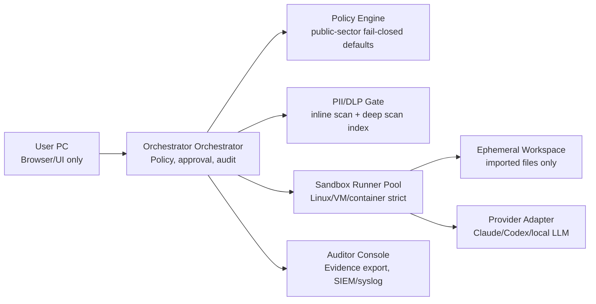

# Public Sector Hardening Implementation Plan

> **For agentic workers:** REQUIRED SUB-SKILL: Use superpowers:subagent-driven-development (recommended) or superpowers:executing-plans to implement this plan task-by-task. Steps use checkbox (`- [ ]`) syntax for tracking.

**Goal:** Build a public-sector deployment profile where Orchestrator Pipeline becomes a controlled AI work gateway: user PCs are UI-only, execution happens in sandbox runners, provider calls pass through privacy filtering, and every sensitive action is approved and auditable.

**Architecture:** Add a `public-sector` policy mode that is fail-closed by default. Local execution, personal accounts, plaintext credentials, direct local workspace mounts, and unscanned provider calls are disabled; sandbox-only runners, DLP/PII gates, approval workflow, signed/offline distribution, and auditor evidence become first-class surfaces. The first insertion point is D1 because profile/credential/spawn rewiring is where agency-managed accounts and sandbox-only execution must be enforced.

**Tech Stack:** Node.js 24 CommonJS, Express routes, current RunnerRegistry/RunnerAgent remote execution path, EvidenceLedger, Windows Credential Manager/DPAPI via keytar where available, future Vault/KMS backend, streaming regex/checksum PII scanner, async deep scan worker, signed release manifest/offline bundle.

---

## 0. Product Positioning

Public-sector Orchestrator is not a prettier wrapper around Claude Code or Codex CLI.

It is an **AI work control layer** for agency networks:

- It moves AI CLI work out of arbitrary local terminals and into controlled sandbox runners.
- It prevents personal AI accounts from touching agency data.
- It scans and masks personal information before data reaches a provider.
- It turns high-risk tool use into an approval workflow.
- It leaves audit evidence that security, privacy, and internal audit teams can inspect.
- It supports closed/internal distribution instead of unattended internet auto-update.

The short message:

> Public-sector Orchestrator lets an agency use Claude/Codex-style AI coding workflows only inside agency policy: sandboxed execution, privacy filtering, approval, network allowlisting, signed distribution, and audit evidence.

## 1. Scope

### In Scope

- `public-sector` deployment profile.
- Sandbox-only execution policy.
- Agency-managed provider profiles.
- Personal-account blocking.
- Plaintext secret fallback blocking.
- Fast inline PII/DLP scan before provider calls and tool output display.
- Deep file import scan for uploaded/imported work material.
- Stable masking tokens for AI usefulness.
- PII-aware approval flow.
- Auditor evidence export.
- Signed/offline release bundle requirement before external public-sector distribution.

### Out of Scope For This Plan

- Legal certification by itself.
- CSAP certification process execution.
- Full data residency contract language.
- Endpoint DLP integration with every agency vendor.
- Training or operating a large custom NER model in the first slice.
- Allowing local PC filesystem execution in public-sector mode.

## 2. Target Architecture



## 3. Non-Negotiable Public-Sector Defaults

| Area | Standard Mode | Public-Sector Mode |
| --- | --- | --- |
| Local executor | Allowed | Disabled |
| Workspace | Local path allowed | Import-only sandbox workspace |
| Provider account | Personal/work/client | Agency-managed only |
| Credential fallback | Dev plaintext possible | Plaintext hard fail |
| Network egress | Configurable | Allowlist-only |
| Auto-update | Notify-only | Signed/offline bundle only |
| Bash/Edit/Write | Approval in R3-e | Approval + PII context + optional 2-person approval |
| Read/Grep/Glob | Allowed under bridge allowlist | File classification-aware |
| Scan failure | Best effort in standard mode | Block |
| Audit | Security events | Security + privacy + approval evidence |

## 4. Acceptance Gates

| Gate | Requirement | Verification |
| --- | --- | --- |
| GOV-G01 | `public-sector` mode disables local Claude/Codex spawn. | Unit test: local spawn request returns policy denial. |
| GOV-G02 | Personal account profiles cannot be created or activated. | Integration test: `accountType=personal` returns 400/403. |
| GOV-G03 | Plaintext credential fallback hard-fails. | Unit test: unavailable secure backend + public-sector -> error. |
| GOV-G04 | Workspaces are sandbox-only and cannot mount arbitrary local paths. | Integration test: profile with local path rejected. |
| GOV-G05 | Runner egress is allowlist-only. | R3-b/R3-e live or Linux-host probe. |
| GOV-G06 | File import runs deep scan before sandbox admission. | Integration test with synthetic XLSX/CSV/text fixtures. |
| GOV-G07 | Provider prompt payload passes inline scan before dispatch. | Unit test: RRN/phone/email masked or blocked. |
| GOV-G08 | Tool output passes inline scan before UI/store/audit exposure. | Integration test: tool output with PII is redacted. |
| GOV-G09 | Masking uses stable tokens per run. | Unit test: same value -> same token, different value -> different token. |
| GOV-G10 | Scan cache avoids re-scanning unchanged content. | Unit test: same chunk hash hits cache. |
| GOV-G11 | Approval UI shows PII risk context for high-risk actions. | UI test: pending approval includes risk summary. |
| GOV-G12 | EvidenceLedger never stores raw secrets or raw detected PII. | Integration test: ledger grep excludes fixture PII. |
| GOV-G13 | Auditor export includes policy mode, account type, sandbox id, hashes, and approvals. | Integration test: export schema snapshot. |
| GOV-G14 | Public-sector release refuses unsigned manifests. | Smoke test: unsigned manifest rejected in public-sector mode. |
| GOV-G15 | Offline bundle install path is documented and testable. | Smoke/manual: no internet, signed bundle installs. |
| GOV-G16 | Scanner timeout/error blocks instead of allowing provider dispatch. | Unit test: scanner throws -> policy denial. |
| GOV-G17 | Inline scanner meets performance budget. | Benchmark: 1 MB text under target budget on Node 24. |
| GOV-G18 | Operator/security docs explain data flow and residual risk. | Docs review checklist. |

## 5. File Map

### New Policy Files

- Create: `src/policy/deploymentProfile.js`  
  Resolves `ORCHESTRATOR_DEPLOYMENT_PROFILE`, exposes fail-closed booleans, and provides reusable assertions.

- Create: `src/policy/publicSectorPolicy.js`  
  Encodes profile, workspace, credential, provider, and scan requirements for agency deployments.

- Test: `tests/unit/deploymentProfile.test.js`
- Test: `tests/unit/publicSectorPolicy.test.js`

### D1 Integration Files

- Modify: `src/runtime/credentialStore.js`  
  Block plaintext fallback in public-sector mode.

- Modify: `src/runtime/profileStore.js`  
  Validate `accountType`, `workspaceMode`, `dataClassification`, and `egressPolicyId`.

- Modify: `src/runtime/profileSpawn.js`  
  Refuse local spawn and inject only policy-approved provider env.

- Modify: `src/executor/claude-runner.js`
- Modify: `src/executor/codex-runner.js`  
  Ensure public-sector mode cannot bypass `profileSpawn`.

- Modify: profile/account routes from D1  
  Reject personal accounts and local workspaces when public-sector mode is active.

### Sandbox Files

- Create: `src/runtime/sandboxWorkspace.js`  
  Creates/imports ephemeral runner workspaces by file hash, not by mounting user paths.

- Modify: `src/server/remoteRunnerSetup.js`
- Modify: `src/runtime/runnerRegistry.js`
- Modify: `src/runner/runnerAgent.js`

### PII/DLP Files

- Create: `src/security/piiPatterns.js`  
  Fast deterministic patterns and checksum validators.

- Create: `src/security/piiScanner.js`  
  Streaming inline scanner with stable token masking.

- Create: `src/security/piiMasker.js`  
  Per-run token map and no-persist default.

- Create: `src/security/deepScanQueue.js`  
  Async import scanner and classification index writer.

- Create: `src/runtime/classificationIndex.js`  
  Stores file hash, chunk hash, detected categories, risk level, scan timestamp.

- Test: `tests/unit/piiScanner.test.js`
- Test: `tests/unit/piiMasker.test.js`
- Test: `tests/integration/file-import-dlp.test.js`

### Approval/Audit/UI Files

- Modify: R3-e approval backend files after they land.
- Create: `src/routes/auditorRoutes.js`
- Create: `public/js/monitor/panels/auditor-panel.js`
- Modify: `public/js/monitor/panels/settings-accounts.js`
- Modify: `public/js/monitor/panels/approval-panel.js`
- Modify: `public/js/monitor/panels/approval-card.js`

### Release Files

- Modify: `scripts/launcher/launcher-cli.js`
- Modify: `scripts/launcher/install-version.ps1`
- Modify: `scripts/launcher/install-version.sh`
- Create: `scripts/release/sign-manifest.js`
- Create: `scripts/release/verify-bundle.js`
- Create: `docs/public-sector-operator-guide.md`

## 6. Slice Plan

### Task 1: GOV-0 Policy Baseline During D1

**Files:**
- Create: `src/policy/deploymentProfile.js`
- Create: `src/policy/publicSectorPolicy.js`
- Test: `tests/unit/deploymentProfile.test.js`
- Test: `tests/unit/publicSectorPolicy.test.js`

- [ ] **Step 1: Write deployment profile tests**

```js
// tests/unit/deploymentProfile.test.js
"use strict";

const assert = require("node:assert/strict");
const test = require("node:test");
const { resolveDeploymentProfile } = require("../../src/policy/deploymentProfile");

test("defaults to standard mode", () => {
  const profile = resolveDeploymentProfile({ env: {} });
  assert.equal(profile.mode, "standard");
  assert.equal(profile.publicSector, false);
});

test("public-sector mode is fail-closed", () => {
  const profile = resolveDeploymentProfile({
    env: { ORCHESTRATOR_DEPLOYMENT_PROFILE: "public-sector" },
  });
  assert.equal(profile.mode, "public-sector");
  assert.equal(profile.publicSector, true);
  assert.equal(profile.allowLocalExecutor, false);
  assert.equal(profile.allowPersonalAccounts, false);
  assert.equal(profile.allowPlaintextSecrets, false);
  assert.equal(profile.requireSandboxWorkspace, true);
  assert.equal(profile.requirePiiScanBeforeProviderDispatch, true);
});
```

- [ ] **Step 2: Implement deployment profile resolver**

```js
// src/policy/deploymentProfile.js
"use strict";

const MODES = new Set(["standard", "public-sector"]);

function resolveDeploymentProfile(opts = {}) {
  const env = opts.env || process.env;
  const requested = env.ORCHESTRATOR_DEPLOYMENT_PROFILE || "standard";
  const mode = MODES.has(requested) ? requested : "standard";
  const publicSector = mode === "public-sector";

  return Object.freeze({
    mode,
    publicSector,
    allowLocalExecutor: !publicSector,
    allowPersonalAccounts: !publicSector,
    allowPlaintextSecrets: !publicSector && env.ORCHESTRATOR_ALLOW_PLAINTEXT_SECRETS === "1",
    requireSandboxWorkspace: publicSector,
    requireAgencyManagedAccount: publicSector,
    requireSignedManifest: publicSector,
    requirePiiScanBeforeProviderDispatch: publicSector,
    scannerFailurePolicy: publicSector ? "block" : "warn",
  });
}

module.exports = { resolveDeploymentProfile };
```

- [ ] **Step 3: Write public-sector policy tests**

```js
// tests/unit/publicSectorPolicy.test.js
"use strict";

const assert = require("node:assert/strict");
const test = require("node:test");
const {
  validateProfileForPublicSector,
  assertLocalExecutorAllowed,
} = require("../../src/policy/publicSectorPolicy");

test("rejects personal accounts in public-sector mode", () => {
  const result = validateProfileForPublicSector({
    accountType: "personal",
    workspaceMode: "sandbox",
    credentialBackend: "wincred",
  });
  assert.equal(result.ok, false);
  assert.match(result.errors.join("\n"), /personal/);
});

test("rejects local workspace mode", () => {
  const result = validateProfileForPublicSector({
    accountType: "agency_managed",
    workspaceMode: "local",
    credentialBackend: "wincred",
  });
  assert.equal(result.ok, false);
  assert.match(result.errors.join("\n"), /sandbox/);
});

test("local executor is denied", () => {
  assert.throws(
    () => assertLocalExecutorAllowed({ mode: "public-sector", allowLocalExecutor: false }),
    /local executor disabled/,
  );
});
```

- [ ] **Step 4: Implement policy assertions**

```js
// src/policy/publicSectorPolicy.js
"use strict";

function validateProfileForPublicSector(profile) {
  const errors = [];
  if (profile.accountType !== "agency_managed") {
    errors.push("public-sector profiles must use accountType=agency_managed");
  }
  if (profile.workspaceMode !== "sandbox") {
    errors.push("public-sector profiles must use workspaceMode=sandbox");
  }
  if (profile.credentialBackend === "plaintext" || profile.credentialBackend === "plaintext_dev_only") {
    errors.push("public-sector profiles cannot use plaintext credential backends");
  }
  if (!profile.egressPolicyId) {
    errors.push("public-sector profiles require egressPolicyId");
  }
  return { ok: errors.length === 0, errors };
}

function assertLocalExecutorAllowed(deploymentProfile) {
  if (deploymentProfile && deploymentProfile.allowLocalExecutor === false) {
    const err = new Error("local executor disabled by public-sector policy");
    err.code = "PUBLIC_SECTOR_LOCAL_EXECUTOR_DISABLED";
    throw err;
  }
}

module.exports = {
  validateProfileForPublicSector,
  assertLocalExecutorAllowed,
};
```

- [ ] **Step 5: Run tests**

Run: `npm test -- tests/unit/deploymentProfile.test.js tests/unit/publicSectorPolicy.test.js`

Expected: both files pass.

- [ ] **Step 6: Commit**

```bash
git add src/policy/deploymentProfile.js src/policy/publicSectorPolicy.js tests/unit/deploymentProfile.test.js tests/unit/publicSectorPolicy.test.js
git commit -m "D1-gov: add public-sector deployment policy baseline"
```

### Task 2: D1 Public-Sector Profile And Credential Enforcement

**Files:**
- Modify: `src/runtime/credentialStore.js`
- Modify: `src/runtime/profileStore.js`
- Modify: `src/runtime/profileSpawn.js`
- Modify: profile routes created by D1
- Test: `tests/unit/credentialStore.test.js`
- Test: `tests/unit/profileStore.test.js`
- Test: `tests/unit/profileSpawn.test.js`
- Test: `tests/integration/profile-routes.test.js`

- [ ] **Step 1: Add schema fields to profile tests**

Required public-sector profile shape:

```json
{
  "id": "agency-claude",
  "label": "Agency Claude",
  "provider": "claude",
  "accountType": "agency_managed",
  "workspaceMode": "sandbox",
  "dataClassification": "internal",
  "egressPolicyId": "agency-llm-egress",
  "credentialBackend": "wincred",
  "secretRefs": {
    "ANTHROPIC_API_KEY": "credential://HarnessPipeline/agency-claude/ANTHROPIC_API_KEY"
  }
}
```

- [ ] **Step 2: Block plaintext credential fallback**

In `credentialStore`, when `resolveDeploymentProfile().publicSector` is true and secure storage is unavailable, return an error with code `PUBLIC_SECTOR_SECURE_STORE_REQUIRED`.

- [ ] **Step 3: Block personal account profiles**

In profile create/update routes, call `validateProfileForPublicSector(profile)` before persistence when mode is `public-sector`. Return HTTP 400 with machine-readable error:

```json
{
  "ok": false,
  "error": "public_sector_profile_policy",
  "details": ["public-sector profiles must use accountType=agency_managed"]
}
```

- [ ] **Step 4: Block local spawn**

In `profileSpawn.buildSpawnEnv` and Claude/Codex runners, call `assertLocalExecutorAllowed(deploymentProfile)` before any direct local spawn path.

- [ ] **Step 5: Run focused tests**

Run:

```bash
npm test -- tests/unit/credentialStore.test.js tests/unit/profileStore.test.js tests/unit/profileSpawn.test.js tests/integration/profile-routes.test.js
```

Expected: public-sector policy failures are explicit and standard mode remains unchanged.

- [ ] **Step 6: Commit**

```bash
git add src/runtime/credentialStore.js src/runtime/profileStore.js src/runtime/profileSpawn.js src/routes tests/unit tests/integration
git commit -m "D1-gov: enforce agency profiles and secure credentials"
```

### Task 3: GOV-SB-0 Sandbox-Only Execution

**Files:**
- Create: `src/runtime/sandboxWorkspace.js`
- Modify: `src/server/remoteRunnerSetup.js`
- Modify: `src/runtime/runnerRegistry.js`
- Modify: `src/runner/runnerAgent.js`
- Test: `tests/unit/sandboxWorkspace.test.js`
- Test: `tests/integration/public-sector-sandbox-only.test.js`

- [ ] **Step 1: Define sandbox workspace contract**

```js
// src/runtime/sandboxWorkspace.js
"use strict";

const path = require("node:path");

function resolveSandboxWorkspace({ runId, dataDir }) {
  if (!/^[A-Za-z0-9._-]+$/.test(runId)) {
    throw new Error("sandbox workspace runId must be path-safe");
  }
  return path.join(dataDir, "sandbox-workspaces", runId);
}

function rejectHostMounts(profile) {
  if (profile.workspacePath || profile.mounts || profile.hostPath) {
    const err = new Error("host filesystem mounts are disabled by public-sector policy");
    err.code = "PUBLIC_SECTOR_HOST_MOUNT_DISABLED";
    throw err;
  }
}

module.exports = { resolveSandboxWorkspace, rejectHostMounts };
```

- [ ] **Step 2: Add runner dispatch guard**

Before dispatching a public-sector run, reject any request that contains `workspacePath`, `mounts`, or direct local filesystem roots.

- [ ] **Step 3: Add import-only workspace path**

Only files that passed deep scan may be copied into the sandbox workspace. The runner receives a workspace id and imported file list, not the user's local path.

- [ ] **Step 4: Run tests**

Run:

```bash
npm test -- tests/unit/sandboxWorkspace.test.js tests/integration/public-sector-sandbox-only.test.js
```

Expected: local path/mount attempts fail; imported sandbox workspace succeeds.

- [ ] **Step 5: Commit**

```bash
git add src/runtime/sandboxWorkspace.js src/server src/runtime/runnerRegistry.js src/runner tests/unit tests/integration
git commit -m "GOV-SB-0: require sandbox-only execution in public-sector mode"
```

### Task 4: GOV-PII-0 Fast Inline Scanner

**Files:**
- Create: `src/security/piiPatterns.js`
- Create: `src/security/piiScanner.js`
- Create: `src/security/piiMasker.js`
- Test: `tests/unit/piiScanner.test.js`
- Test: `tests/unit/piiMasker.test.js`

- [ ] **Step 1: Add deterministic pattern tests**

Minimum categories:

- `rrn`: Korean resident registration number with checksum validation.
- `foreign_registration`: foreign resident registration number.
- `phone`: mobile and regional phone formats.
- `email`: common email format.
- `card`: 13-19 digit card candidate with Luhn check.
- `account`: bank account candidate by separator/length context.
- `address`: Korean address candidate using city/province + district context.
- `bulk_table`: CSV/TSV/table with repeated PII columns.

- [ ] **Step 2: Implement streaming scanner API**

```js
// src/security/piiScanner.js
"use strict";

function scanText(input, opts = {}) {
  const text = String(input || "");
  const maxChars = opts.maxChars || 1_000_000;
  if (text.length > maxChars) {
    return {
      ok: false,
      action: "block",
      reason: "inline_scan_size_limit",
      findings: [],
      redactedText: "",
    };
  }

  // Implementation imports pattern matchers from piiPatterns.js.
  // Each finding shape:
  // { category, start, end, confidence, action }
  return {
    ok: true,
    action: "allow",
    reason: null,
    findings: [],
    redactedText: text,
  };
}

module.exports = { scanText };
```

- [ ] **Step 3: Implement stable masking tokens**

```js
// src/security/piiMasker.js
"use strict";

function createRunMasker() {
  const seen = new Map();
  const counters = new Map();

  function tokenFor(category, rawValue) {
    const key = `${category}:${rawValue}`;
    if (seen.has(key)) return seen.get(key);
    const next = (counters.get(category) || 0) + 1;
    counters.set(category, next);
    const token = `[${category.toUpperCase()}_${String(next).padStart(3, "0")}]`;
    seen.set(key, token);
    return token;
  }

  return { tokenFor };
}

module.exports = { createRunMasker };
```

- [ ] **Step 4: Enforce fail-closed behavior**

When `deploymentProfile.scannerFailurePolicy === "block"`, scanner errors and timeouts return policy denial. Do not dispatch to providers.

- [ ] **Step 5: Run tests and benchmark**

Run:

```bash
npm test -- tests/unit/piiScanner.test.js tests/unit/piiMasker.test.js
node scripts/bench/pii-inline-bench.js
```

Expected: synthetic PII is masked or blocked, same values produce same tokens, and 1 MB text stays within the documented budget.

- [ ] **Step 6: Commit**

```bash
git add src/security/piiPatterns.js src/security/piiScanner.js src/security/piiMasker.js tests/unit scripts/bench
git commit -m "GOV-PII-0: add fail-closed inline PII scanner"
```

### Task 5: GOV-PII-1 Deep File Import Scan

**Files:**
- Create: `src/security/deepScanQueue.js`
- Create: `src/runtime/classificationIndex.js`
- Create: `src/routes/fileImportRoutes.js`
- Test: `tests/integration/file-import-dlp.test.js`

- [ ] **Step 1: Classification index shape**

```json
{
  "fileSha256": "64 hex chars",
  "sizeBytes": 12345,
  "mime": "text/csv",
  "risk": "low|medium|high|blocked",
  "categories": ["phone", "email", "bulk_table"],
  "chunkHashes": ["64 hex chars"],
  "scanVersion": "pii-v1",
  "scannedAt": "2026-04-29T00:00:00.000Z"
}
```

- [ ] **Step 2: Deep scan pipeline**

Implement import flow:

1. Compute SHA256.
2. Look up classification index by hash.
3. If cache hit and scan version matches, reuse result.
4. If cache miss, parse supported text/CSV/JSON/Markdown first.
5. Mark unsupported binary as `blocked` until a parser is added.
6. Copy only allowed files into sandbox workspace.

- [ ] **Step 3: Add scan budget**

If scan exceeds configured time or file size budget, classify as `blocked` with reason `scan_budget_exceeded`.

- [ ] **Step 4: Run integration tests**

Run: `npm test -- tests/integration/file-import-dlp.test.js`

Expected: clean fixture imports, PII fixture is masked or blocked, unsupported binary blocks.

- [ ] **Step 5: Commit**

```bash
git add src/security/deepScanQueue.js src/runtime/classificationIndex.js src/routes/fileImportRoutes.js tests/integration/file-import-dlp.test.js
git commit -m "GOV-PII-1: scan imported files before sandbox admission"
```

### Task 6: GOV-APPROVAL-0 PII-Aware Approval

**Files:**
- Modify: R3-e approval backend files after R3-e lands.
- Modify: `public/js/monitor/panels/approval-card.js`
- Modify: `public/js/monitor/panels/approval-panel.js`
- Test: approval backend and UI tests from R3-e.

- [ ] **Step 1: Extend approval request schema**

Approval requests include:

```json
{
  "id": "approval-id",
  "runId": "run-id",
  "tool": "Bash|Edit|Write|Read|Grep|Glob",
  "argsHash": "64 hex chars",
  "risk": "low|medium|high|blocked",
  "piiSummary": {
    "categories": ["phone", "email"],
    "counts": { "phone": 2, "email": 1 },
    "rawValuesStored": false
  },
  "dataClassification": "internal",
  "requiresTwoPersonApproval": false
}
```

- [ ] **Step 2: Block high-risk operations by default**

For `risk=blocked`, return denial without presenting an approve button. For `risk=high`, require explicit reason and optional second approval when policy says so.

- [ ] **Step 3: Update Simple and Advanced UI**

Simple UI shows plain-language risk:

- "개인정보 후보가 포함되어 자동 마스킹되었습니다."
- "원문 개인정보가 포함되어 있어 이 작업은 차단되었습니다."
- "승인하면 격리된 샌드박스에서만 실행됩니다."

Advanced UI shows categories, counts, file hashes, tool, args hash, provider, and sandbox id.

- [ ] **Step 4: Run approval tests**

Run: `npm test -- tests/unit/approval*.test.js tests/integration/approval*.test.js`

Expected: approval decisions are bound to exact `(tool, argsHash, piiSummary)` and cannot be replayed for changed args.

- [ ] **Step 5: Commit**

```bash
git add src public/js tests
git commit -m "GOV-APPROVAL-0: add PII-aware approval context"
```

### Task 7: GOV-AUDIT-0 Auditor Evidence And SIEM Export

**Files:**
- Create: `src/routes/auditorRoutes.js`
- Create: `src/audit/publicSectorEvidence.js`
- Create: `public/js/monitor/panels/auditor-panel.js`
- Test: `tests/integration/auditor-routes.test.js`

- [ ] **Step 1: Define export schema**

Auditor export must include:

- `runId`
- `policyMode`
- `profileId`
- `accountType`
- `provider`
- `sandboxId`
- `egressPolicyId`
- file hashes and classification results
- approval decisions
- scanner version and action
- ledger verification result

It must not include raw provider secrets, raw detected PII, or plaintext prompt content unless an agency explicitly enables an encrypted evidence vault.

- [ ] **Step 2: Add auditor route**

Route: `GET /api/auditor/runs/:runId/evidence`

Response:

```json
{
  "ok": true,
  "runId": "run-id",
  "policyMode": "public-sector",
  "ledgerVerified": true,
  "rawPiiIncluded": false,
  "items": []
}
```

- [ ] **Step 3: Add SIEM/syslog export format**

Emit line-delimited JSON with redacted fields and stable event names:

- `public_sector_profile_rejected`
- `pii_scan_blocked`
- `pii_scan_masked`
- `sandbox_dispatch_denied`
- `approval_granted`
- `approval_denied`
- `release_signature_failed`

- [ ] **Step 4: Run tests**

Run: `npm test -- tests/integration/auditor-routes.test.js`

Expected: evidence export exists, verifies ledger, and contains no fixture PII.

- [ ] **Step 5: Commit**

```bash
git add src/routes/auditorRoutes.js src/audit/publicSectorEvidence.js public/js/monitor/panels/auditor-panel.js tests/integration/auditor-routes.test.js
git commit -m "GOV-AUDIT-0: add public-sector auditor evidence export"
```

### Task 8: GOV-RELEASE-0 Signed And Offline Distribution

**Files:**
- Modify: `scripts/launcher/launcher-cli.js`
- Modify: `scripts/launcher/install-version.ps1`
- Modify: `scripts/launcher/install-version.sh`
- Create: `scripts/release/sign-manifest.js`
- Create: `scripts/release/verify-bundle.js`
- Create: `docs/public-sector-operator-guide.md`
- Test: `tests/smoke/public-sector-release.test.js`

- [ ] **Step 1: Require signed manifest in public-sector mode**

When `ORCHESTRATOR_DEPLOYMENT_PROFILE=public-sector`, installer mode rejects a manifest without signature metadata.

Required manifest extension:

```json
{
  "version": "1.1.0",
  "publishedAt": "2026-05-15T09:00:00Z",
  "url": "https://agency.internal/releases/orchestrator-pipeline-1.1.0.zip",
  "sha256": "64 lowercase hex chars",
  "minNodeVersion": "24.0.0",
  "signature": {
    "type": "ed25519",
    "keyId": "agency-release-key-2026",
    "value": "base64 signature"
  }
}
```

- [ ] **Step 2: Add offline bundle verification**

`verify-bundle.js` verifies:

1. manifest schema
2. manifest signature
3. zip SHA256
4. zip file list denylist
5. expected launcher files

- [ ] **Step 3: Add public-sector operator guide**

Document:

- no internet install path
- release key handling
- how to rotate signing keys
- how to verify bundle before deployment
- how to uninstall and destroy local data
- residual risk statement

- [ ] **Step 4: Run smoke tests**

Run: `npm run test:smoke -- public-sector-release`

Expected: unsigned manifest rejected, signed test fixture accepted, tampered zip rejected.

- [ ] **Step 5: Commit**

```bash
git add scripts/launcher scripts/release docs/public-sector-operator-guide.md tests/smoke/public-sector-release.test.js
git commit -m "GOV-RELEASE-0: require signed offline bundles for public-sector mode"
```

## 7. Performance Plan For PII/DLP

Avoid a single heavy "AI privacy detector" in the hot path.

### Fast Inline Scanner

- Runs synchronously before provider dispatch and before tool output reaches UI/store/audit.
- Uses deterministic regex, checksum validation, context windows, and small rolling buffers.
- Has a strict max size budget.
- On budget exceed in public-sector mode: block.
- Does not call external services.

### Deep Import Scanner

- Runs when files are imported into the sandbox.
- Uses file hash and chunk hash cache.
- Parses cheap formats first: text, markdown, JSON, CSV, TSV.
- Adds XLSX/DOCX/PDF parsers in later slices behind tests.
- Unsupported or failed parse means blocked in public-sector mode.

### Stable Masking

- Same raw value in one run gets the same token.
- Token map is in-memory by default.
- If reversible mapping is required, store it only in an agency-approved encrypted vault with short TTL and audit.

### Performance Budgets

| Path | Budget | Failure Policy |
| --- | --- | --- |
| Inline prompt scan | target under 100 ms for normal prompt | block on timeout |
| Inline tool output scan | streaming, chunked | block/redact before UI |
| File import scan | async, cache by file hash | block until scan complete |
| Deep scan parser failure | n/a | block |

## 8. Security Rules

- Prefer allowlists over denylists.
- Validate every route payload server-side.
- Do not trust UI-only validation.
- Do not log raw secrets or raw PII.
- Do not store prompt originals in public-sector mode by default.
- Do not allow direct local filesystem mounts.
- Do not allow personal provider accounts.
- Do not silently downgrade to plaintext secrets.
- Do not dispatch provider calls when scanner state is unknown.
- Do not auto-update public-sector installations.

## 9. D1 Timing Recommendation

D1 is the correct moment to insert the public-sector baseline because D1 owns profiles, credentials, and spawn rewiring.

Recommended D1 order:

1. `D1-a credentialStore`
2. `D1-b profileStore`
3. `D1-gov policy baseline`
4. `D1-c profileSpawn`
5. `D1-d Claude/Codex spawn rewiring`
6. `D1-e routes + audit sanitizer`

Do not wait until after D1 to add public-sector constraints. If D1 permits personal profiles, plaintext fallback, or direct local spawn first, later hardening becomes a breaking migration.

## 10. Compliance Mapping Notes

This plan is not legal certification. It prepares technical controls that can support later compliance review.

Relevant review tracks:

- Personal Information Protection Act and public-sector personal information impact assessment.
- Agency internal network/security policy.
- Cloud/SaaS path: CSAP and data residency review.
- Closed/internal distribution: signed release bundle, SBOM, offline verification.
- Audit: evidence retention, destruction, and incident response procedures.

## 11. Scorecard Impact Proposal

Do not move the score for the plan alone.

Suggested movement after verified implementation:

- GOV-0 + D1 enforcement: Safety cap +1, Config/portability +1 if live profile routes pass.
- GOV-SB-0: Safety +1 after sandbox-only live proof.
- GOV-PII-0/1: Safety +1 and Public-sector readiness cap introduced.
- GOV-AUDIT-0: Observability +1 if evidence export is behavior-verified.
- GOV-RELEASE-0: Config/portability +1 after signed/offline bundle smoke passes.

## 12. Round Exit Criteria

The public-sector baseline is not complete until all are true:

- `ORCHESTRATOR_DEPLOYMENT_PROFILE=public-sector` blocks local executor paths.
- Agency-managed profile creation succeeds; personal profile creation fails.
- Secure credential backend failure blocks setup.
- Sandbox-only run dispatch succeeds with imported files.
- Direct local workspace dispatch fails.
- Inline scanner masks or blocks synthetic PII before provider dispatch.
- Scanner failure blocks.
- EvidenceLedger and auditor export contain no fixture PII.
- Unsigned public-sector release manifest fails.
- Signed/offline test bundle verifies.

