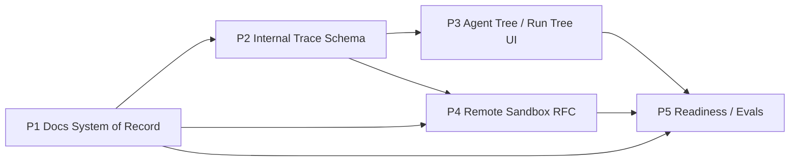

# Five-Priority Roadmap After Run Monitor UI Spec

Date: 2026-04-27
Status: Draft roadmap for post-spec execution planning
Parent spec: `docs/superpowers/specs/2026-04-27-run-monitor-ui-hybrid-design.md`

## 1. Purpose

This roadmap defines the next five planning priorities that should follow the run-monitor UI spec. The goal is to avoid treating the UI as an isolated redesign and instead use it as the front door to a better-documented, more observable, more testable harness.

The five priorities are:

1. Repo-local docs as the system of record
2. Internal trace schema
3. Agent Tree / Run Tree UI
4. Remote sandbox RFC
5. Harness readiness / eval bundle

This document assumes the run-monitor UI spec is the baseline design and that implementation work will proceed conservatively, with behavior-preserving slices and debug review after the spec-driven work is complete.

## 2. Planning principles

1. Docs first, because the agent can only reliably use what is in-repo and versioned.
2. Contracts before rendering, so monitor UI work sits on stable semantics instead of ad-hoc event handling.
3. Observability before remote execution, so future sandbox work does not outrun visibility.
4. Eval gates throughout, not only at the end.
5. Keep every step compatible with the current local-first harness.

## 3. Recommended execution order

The priorities should not be treated as five unrelated projects. They form a staged chain:

### Wave A: Foundation

1. Repo-local docs as system of record
2. Internal trace schema

### Wave B: Primary product slice

3. Agent Tree / Run Tree UI

### Wave C: Future-mode design

4. Remote sandbox RFC

### Wave D: Confidence and release gating

5. Harness readiness / eval bundle

Recommended rule:

- Priority 1 and Priority 2 begin first.
- Priority 3 begins once Priority 2 has a stable event/store contract.
- Priority 4 begins after Priority 1 and Priority 2 settle enough to define remote-mode boundaries precisely.
- Priority 5 starts as soon as there are stable contracts to test, but its final form lands after Priorities 1 through 4.

## 4. Priority 1: Repo-local docs as system of record

### Goal

Turn the repository itself into the primary source of truth for architecture, operations, UI behavior, security, and roadmap state.

### Why now

The UI spec, security reimplementation, multi-run model, and environment diagnostics now span several documents and plan files. If the docs remain fragmented between repo docs and user-local plans, future agent runs will reason over partial context.

### Deliverables

- A canonical docs map that explains what each major document owns
- Clear ownership boundaries between architecture, security, UI, roadmap, and operational docs
- Links from repo entry points to canonical docs
- Reduction of duplicated or stale design statements

### Suggested file targets

- `docs/harness-architecture.md`
- `docs/security-model.md`
- `docs/scorecard.md`
- `docs/remote-mode-design.md`
- `docs/container-sandbox.md`
- `docs/superpowers/specs/2026-04-27-run-monitor-ui-hybrid-design.md`
- New: `docs/README.md` or `docs/index.md`
- Optional: `docs/monitor-architecture.md`

### Plan slices

#### P1-A Docs map

- Add one top-level docs index that explains canonical documents and intended readership.

#### P1-B Architecture sync

- Sync architecture doc with Phase 2.5, Phase 3-S, childRegistry, multi-run isolation, and the new monitor-ui direction.

#### P1-C UI doc surface

- Promote the monitor UI spec into the docs graph so future work does not depend on out-of-band memory.

#### P1-D Scorecard sync

- Make the scorecard explicitly reference the next roadmap items and current structural debt.

### Exit criteria

- A new contributor or agent can find the current architecture, UI direction, security model, and roadmap from inside the repo without relying on local plan folders.
- No two docs claim conflicting ownership of the same concern.

### Risks

- Risk: docs churn without true consolidation
  Mitigation: assign one canonical owner doc per major concern

## 5. Priority 2: Internal trace schema

### Goal

Define a canonical trace/event model that connects runtime events, replay, monitor bootstrap payloads, and future observability export.

### Why now

The UI plan depends on a stable event contract. Current events exist, but they are consumed through a mix of legacy switch logic, panel-specific assumptions, and route-level payload shapes. Without a schema, the new monitor shell would inherit the current coupling.

### Deliverables

- A documented monitor/trace envelope
- A normalized event taxonomy for runs, phases, tools, subagents, children, findings, and server lifecycle
- A clear distinction between raw runtime events and normalized monitor events
- Route payload shapes for monitor bootstrap and run detail views

### Suggested file targets

- New: `docs/trace-schema.md`
- `src/routes/runsRoutes.js`
- New: `src/routes/monitorRoutes.js`
- `src/runtime/eventReplayBuffer.js`
- `src/runtime/runRegistry.js`
- `public/js/event-dispatcher.js`
- New: `public/js/monitor/normalizer.js`
- New: `public/js/monitor/store.js`

### Plan slices

#### P2-A Envelope definition

- Define the canonical event envelope:
  `type`, `runId`, `ts`, `scope`, `summary`, `payload`

#### P2-B Event taxonomy

- Define categories for:
  run lifecycle, phase lifecycle, tool call, critique/finding, subagent lifecycle, child lifecycle, replay lifecycle, server lifecycle

#### P2-C Bootstrap/read models

- Define `GET /api/monitor/bootstrap` and `GET /api/monitor/runs/:runId` response shapes.

#### P2-D Legacy bridge

- Define how `public/app.js` and the current WebSocket stream bridge into the normalized monitor contract without changing runtime behavior first.

### Exit criteria

- The monitor UI can be built against a single documented contract instead of implicit assumptions.
- Replay, run-history, analytics, and future observability can all point to the same vocabulary.

### Risks

- Risk: overdesigning the schema before real UI pressure appears
  Mitigation: keep the first schema centered on currently emitted events and monitor use cases only

## 6. Priority 3: Agent Tree / Run Tree UI

### Goal

Implement the first major monitor UI slice: a mixed operations view centered on run switching, hierarchy visibility, and selected-run drill-down.

### Why now

This is the main user-facing payoff of the new UI direction. It turns the trace/schema work into a practical surface and provides the first proof that the hybrid architecture is worth keeping.

### Deliverables

- Left-rail Run Tree
- Left-rail or adjacent Agent Tree for subagents/children
- Center selected-run workspace
- Right-side inspector
- Bottom dock integration with terminal, raw log, and replay
- Compatibility with the existing run tab bar during transition

### Suggested file targets

- `public/index.html`
- `public/style.css`
- `public/app.js`
- New: `public/js/monitor/layout.js`
- New: `public/js/monitor/panels/run-tree.js`
- New: `public/js/monitor/panels/agent-tree.js`
- New: `public/js/monitor/panels/run-summary.js`
- New: `public/js/monitor/panels/timeline.js`
- New: `public/js/monitor/panels/inspector.js`
- New: `public/js/monitor/panels/bottom-dock.js`

### Plan slices

#### P3-A Shell

- Add layout mounts for global bar, left rail, center workspace, right inspector, and bottom dock.

#### P3-B Run Tree

- Build the run list around normalized monitor state, not direct DOM mutation from legacy handlers.

#### P3-C Agent Tree

- Surface subagent and child-process hierarchy under the selected run.

#### P3-D Inspector and dock

- Make selection state explicit so timeline items, findings, and children can be inspected consistently.

#### P3-E Legacy reduction

- Narrow `public/app.js` to compatibility duties and move new state ownership into monitor modules.

### Exit criteria

- A user can answer "what is running, what is stuck, and what belongs to this run?" from the main screen without opening separate drawers first.
- The monitor shell works with the current runtime and does not regress run isolation or replay correctness.

### Risks

- Risk: building a visually better screen while leaving `public/app.js` as the real owner
  Mitigation: make `monitor/store.js` the single source of monitor-facing UI state

## 7. Priority 4: Remote sandbox RFC

### Goal

Define the design and constraints for remote or team execution without implementing it prematurely.

### Why now

Once run-monitoring and trace contracts exist, the next tempting step is remote execution. That is also where risk grows quickly. A design-only RFC keeps progress disciplined and lets the team shape required metadata and trust boundaries before any runtime widening happens.

### Deliverables

- A concrete RFC for remote execution isolation
- Clear definitions for run origin, trust boundary, workspace isolation, child isolation, and network policy
- Required monitor/trace metadata for remote runs
- Explicit non-goals and rollout gates

### Suggested file targets

- `docs/remote-mode-design.md`
- `docs/container-sandbox.md`
- Optional new consolidator: `docs/remote-sandbox-rfc.md`
- `docs/harness-architecture.md`
- `docs/trace-schema.md`

### Plan slices

#### P4-A Current-state boundary audit

- Document what "local-first" currently guarantees and where those guarantees would break under remote execution.

#### P4-B Isolation model

- Define workspace, process, token, file-system, and network boundaries for remote runs.

#### P4-C Monitor metadata

- Reserve fields for run origin, sandbox class, host identity, and isolation status in the trace/monitor model.

#### P4-D Rollout gates

- Define what must exist before any remote mode can be enabled:
  observability, lifecycle cleanup, token policy, sandboxed workspace, and readiness checks

### Exit criteria

- Remote mode is no longer a vague future feature; it is a bounded design with explicit prerequisites.
- No code changes are required to keep moving on local-first quality while the RFC remains design-only.

### Risks

- Risk: turning an RFC into stealth implementation
  Mitigation: keep this priority documentation-only until explicit approval

## 8. Priority 5: Harness readiness / eval bundle

### Goal

Create a repeatable readiness bundle that scores and verifies the harness as an operating system for runs, not only as a collection of tests.

### Why now

The project already has strong unit and integration coverage, but the next wave needs a higher-level confidence layer focused on monitor visibility, replay integrity, child visibility, and boundary correctness.

### Deliverables

- A readiness rubric aligned with current architecture
- A one-command readiness report or script
- Explicit checks for monitor/trace/child/replay/server summary quality
- Scorecard inputs that map technical progress to operational confidence

### Suggested file targets

- New: `docs/readiness-rubric.md`
- `docs/scorecard.md`
- New: `scripts/readiness-check.ps1` or `scripts/readiness-report.js`
- `scripts/env-check.ps1`
- New tests around monitor bootstrap, run detail, and hierarchy visibility

### Plan slices

#### P5-A Rubric definition

- Define what "ready" means for the harness at this stage.

#### P5-B Readiness report

- Add a report that summarizes route health, run visibility, child visibility, replay visibility, and sync state.

#### P5-C Test alignment

- Add tests that map directly to readiness assertions instead of only low-level module behavior.

#### P5-D Scorecard linkage

- Update the scorecard to consume the readiness rubric and report meaningful remaining gaps.

### Exit criteria

- The team can answer "is the harness ready for this next wave?" with more than raw test counts.
- Regressions in monitor visibility or runtime observability fail a named readiness check, not just a vague manual review.

### Risks

- Risk: a reporting layer that duplicates existing tests without adding operational meaning
  Mitigation: keep readiness checks focused on cross-cutting behavior and operator visibility

## 9. Dependency summary

The priorities depend on one another in this order:

Operational interpretation:

- P1 removes context ambiguity
- P2 removes contract ambiguity
- P3 turns the contract into product value
- P4 defines the future trust boundary
- P5 turns all of that into enforceable confidence

## 10. Recommended immediate next move

After this roadmap is reviewed:

1. Start P1 and P2 first
2. Treat P3 as the first visible payoff and first major implementation wave
3. Keep P4 design-only until the monitor shell and trace model settle
4. Use P5 as the review gate before wider changes or remote-mode work

## 11. Debug review gate

Per the current working agreement:

- complete the spec-driven implementation work first
- request debug review after the spec implementation wave is done
- use the readiness bundle plan as the structure for that later debug review

That means this roadmap should be ready before implementation continues, but the actual debug audit waits until the UI spec work has landed.
